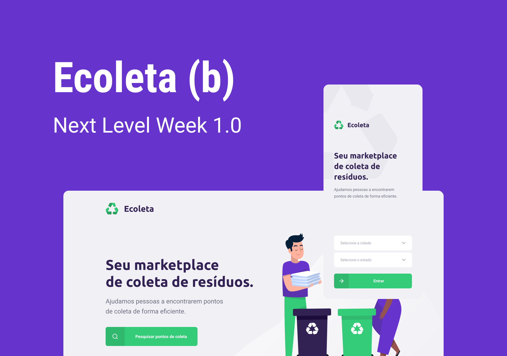

<h1 align="center">
    
</h1>

<h4 align="center"> 
	:construction: NextLevelWeek 1.0 🚀 In progress.. :construction:
</h4>
<p align="center">
  

  
	
  <a href="https://www.linkedin.com/in/vtspereira/">
    
  </a>

  <a href="https://github.com/Vtspereira/NLW_Booster/commits/master">
    
  </a>

  
   <a href="https://github.com/Vtspereira/nlw/stargazers">
  </a>
</p>

<p align="center">
  <a href="#-nlw">Next Level Week</a>&nbsp;&nbsp;&nbsp;|&nbsp;&nbsp;&nbsp;
  <a href="#-project">Project</a>&nbsp;&nbsp;&nbsp;|&nbsp;&nbsp;&nbsp;
  <a href="#rocket-Technologies">Technologies</a>&nbsp;&nbsp;&nbsp;|&nbsp;&nbsp;&nbsp;
  <a href="#-layout">Layout</a>&nbsp;&nbsp;&nbsp;|&nbsp;&nbsp;&nbsp;
  <a href="#-how-to-use">How to use</a>&nbsp;&nbsp;&nbsp;|&nbsp;&nbsp;&nbsp;
  <a href="#-how-to-contribute">How to contribute</a>&nbsp;&nbsp;&nbsp;|&nbsp;&nbsp;&nbsp;
  <a href="#memo-license">License</a>
</p>

## :information_source: What's Next Level Week?

<strong>Ecoleta</strong> is a waste collection marketplace.

Web application built on the <strong>Next Level Week Starter</strong> trail distributed by [Rocketseat](https://rocketseat.com.br/).

## 💻 Project

Ecoleta is a project developed based on international environment week. 
That aims to connect people to companies that collect specific waste such as light bulbs, batteries, cooking oil, etc.

<h1 align="center">
    
</h1>


## :rocket: Technologies

This project was developed with the following technologies:

- [Node.js][nodejs]
- [TypeScript][typescript]
- [React][reactjs]
- [React Native][rn]
- [Expo][expo]

## 🔖 Layout

To access the layout use [Figma](https://www.figma.com/file/1SxgOMojOB2zYT0Mdk28lB/).

## :information_source: How To Use

To clone and run this application, you'll need [Git](https://git-scm.com), [Node.js][nodejs] + [Yarn][yarn] installed on your computer.

From your command line:

### Install API 

```bash
# Clone this repository
$ git clone https://github.com/Vtspereira/NLW_Booster

# Go into the repository
$ cd NLW_Booster/server

# Install dependencies
$ yarn install

# Run Migrates
$ yarn knex:migrate

# Run Seeds
$ yarn knex:seed

# Start server
$ yarn dev

running on port 3333
```

## :memo: License

This project is under the MIT license. See the [LICENSE](https://github.com/Vtspereira/NLW_Booster/blob/master/LICENSE) for details.


Made with ♥ by Vitor Soares :wave: [Get in touch!](https://www.linkedin.com/in/vtspereira/)

[nodejs]: https://nodejs.org/
[typescript]: https://www.typescriptlang.org/
[expo]: https://expo.io/
[reactjs]: https://reactjs.org
[rn]: https://facebook.github.io/react-native/
[yarn]: https://yarnpkg.com/
[vs]: https://code.visualstudio.com/
[vceditconfig]: https://marketplace.visualstudio.com/items?itemName=EditorConfig.EditorConfig
[vceslint]: https://marketplace.visualstudio.com/items?itemName=dbaeumer.vscode-eslint
[prettier]: https://marketplace.visualstudio.com/items?itemName=esbenp.prettier-vscode
